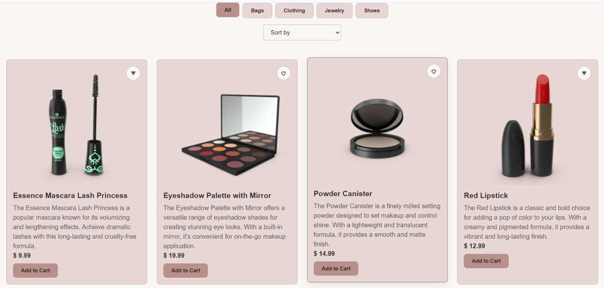
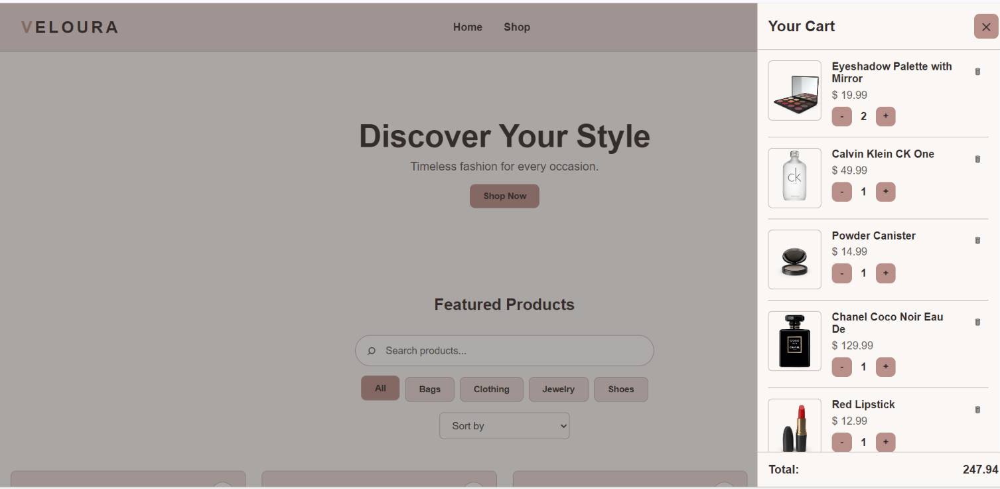

# Veloura (React)

A fashion & accessories e-commerce site, rebuilt in **React** after first building the exact same app in **vanilla JavaScript**.

**Live site:** [veloura-react-ecommerce.netlify.app](https://veloura-react-ecommerce.netlify.app/)
**Vanilla JS version:** [live](https://veloura-ecommerce.netlify.app) · [repo](https://github.com/maryam-dev26/veloura)


## About

This is the second half of a two-part project. The first half was Veloura in plain JavaScript — no framework, every re-render, route, and state update written by hand. This version rebuilds the same features in React, so that each React concept could be compared directly against the manual version I had already built and debugged.

The goal wasn't just "learn React" — it was to understand *what problem each React feature solves*, by having already felt that problem.

## Features

- 🛍️ Product catalog fetched from a live API ([DummyJSON](https://dummyjson.com))
- 🔍 Live search, category filtering, and sorting — all combinable
- 📄 Product detail pages with client-side routing (`/product/:id`) that survive refresh
- 🛒 Cart with quantity controls, running total, and a slide-in drawer
- 🤍 Wishlist with heart toggle, its own drawer, and a "Move to Cart" action
- 💾 Cart and wishlist persist across page reloads (`localStorage`)
- ⏳ Loading and error states for data fetching
- 📱 Responsive, mobile-first layout with an accessible hamburger menu (state-driven, Escape-to-close, click-outside-to-close)

## Tech Stack

- **React** (function components + hooks)
- **Vite** — dev server and build tool
- **React Router** — client-side routing
- **Context API** + `useReducer` — global state (cart, wishlist, products)
- **CSS** — hand-written, reused from the vanilla version (custom properties, Grid/Flexbox, mobile-first media queries)
- **Netlify** — deployment

No Redux, no UI library, no Tailwind — the aim was to work with React's own primitives first.

## Project Structure

```
src/
├── components/
│   ├── Header.jsx
│   ├── Footer.jsx
│   ├── ProductCard.jsx
│   ├── CartDrawer.jsx
│   └── WishlistDrawer.jsx
├── pages/
│   ├── Home.jsx
│   └── ProductDetail.jsx
├── context/
│   ├── ProductsContext.jsx   # fetches products once, shared everywhere
│   ├── CartContext.jsx       # useReducer-based cart state
│   └── WishlistContext.jsx
├── App.jsx
├── main.jsx
└── style.css
```

## Running Locally

```bash
git clone https://github.com/maryam-dev26/veloura-react.git
cd veloura-react
npm install
npm run dev
```

The dev server runs at `http://localhost:5173`. To create a production build: `npm run build` (output goes to `dist/`).

## Screenshots

| Product Grid | Cart Drawer | Mobile View |
|---|---|---|
|  |  |  |

## Vanilla JS vs React — Side by Side

| Concern | Vanilla JS version | React version |
|---|---|---|
| **Rendering** | `map()` + `join("")` + `innerHTML`, with a manual `renderProducts()` call after every change | JSX + `map()`; React re-renders automatically when state changes |
| **State** | Module-level variables, later a central `state` object with setter functions | `useState`, `useReducer`, and Context |
| **Routing** | `location.hash` + a `hashchange` listener, parsed by hand | React Router (`useParams`, `Link`) |
| **Persistence** | `saveCart()` called at the end of every state-changing function | One `useEffect` that watches `cart` |
| **Data fetching** | `async` function orchestrating loading → render → error by hand | `useEffect` + a shared `ProductsContext` |
| **Code structure** | 8 ES modules split by responsibility | Components / pages / context providers |

## What I Learned

A few lessons that came directly from bugs, not from tutorials:

- **The same bug came back in a different disguise.** In the vanilla version, I rendered the cart before the product data had finished loading. In React, the same problem returned when several components each called their own data-fetching hook — each one started with an empty `products` array, and the cart drawer crashed reading `undefined.price`. The fix in both cases was the same idea: fetch once, share it, and never render against data that hasn't arrived. In React that meant moving the fetch into a single `ProductsContext`.
- **Immutability isn't optional in React.** In vanilla I wrote `item.quantity += 1` and re-rendered by hand. In React, state has to be replaced, not mutated — `map()` plus spread — or React can't tell anything changed. Moving the cart to `useReducer` made all update logic live in one place instead of four separate handlers.
- **Context solves a problem I had already felt.** Sharing the cart between the header, product cards, and drawer was awkward with plain modules (I ran into read-only import bindings). Context gave that a proper home — and separating cart and wishlist into different contexts made it clear when *not* to combine state.
- **`useEffect` isn't "run on page load".** The dependency array and the cleanup function matter. Adding a keyboard listener for the hamburger menu without cleanup would stack a new listener on every render — the same mistake I'd made in vanilla, just harder to see.
- **Event bubbling still exists.** Putting an "Add to Cart" button inside a `<Link>` meant clicking it navigated to the detail page too, until I stopped the event from bubbling.
- **The CSS didn't change — but the JSX structure had to match it.** Selectors like `.search-box input` silently stopped working when the wrapper `<div>` was missing, and an absolutely-positioned heart icon floated to the wrong corner until its parent had `position: relative`.

## What's Next

Possible follow-ups: TypeScript, tests (React Testing Library), performance optimisation (`useMemo`, `React.memo`), and a real backend for orders and authentication.

## License

Built for learning purposes. Feel free to explore the code.